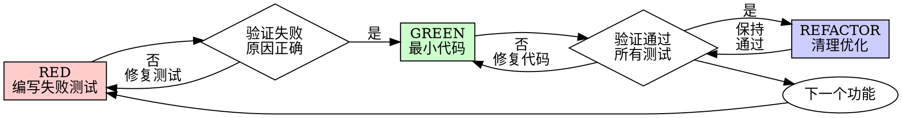

# Test-Driven Development (TDD) 详细流程

## 概述

TDD 是一种开发方法论，核心原则是：**先写测试，看它失败，再写最少的代码让它通过**。

### 核心理念

```
NO PRODUCTION CODE WITHOUT A FAILING TEST FIRST
```

如果你没有看到测试失败，你就不知道它是否测试了正确的东西。

### 适用场景

**必须使用：**
- 新功能开发
- Bug 修复
- 代码重构
- 行为变更

**例外情况（需与用户确认）：**
- 一次性原型
- 生成的代码
- 配置文件

---

## RED-GREEN-REFACTOR 循环



---

## Step 1: RED - 编写失败测试

### 目标
编写一个最小化的测试，描述期望的行为。

### 好的测试示例

```typescript
test('重试失败操作3次', async () => {
  let attempts = 0;
  const operation = () => {
    attempts++;
    if (attempts < 3) throw new Error('fail');
    return 'success';
  };

  const result = await retryOperation(operation);

  expect(result).toBe('success');
  expect(attempts).toBe(3);
});
```

**优点：**
- 清晰的测试名称
- 测试真实行为（非 mock）
- 只测试一件事

### 坏的测试示例

```typescript
test('retry works', async () => {
  const mock = jest.fn()
    .mockRejectedValueOnce(new Error())
    .mockRejectedValueOnce(new Error())
    .mockResolvedValueOnce('success');
  await retryOperation(mock);
  expect(mock).toHaveBeenCalledTimes(3);
});
```

**缺点：**
- 模糊的测试名称
- 测试的是 mock 而非真实代码
- 不展示期望的 API

### 要求

| 要求 | 说明 |
|------|------|
| 一个行为 | 每个测试只验证一个功能点 |
| 清晰名称 | 测试名称应描述行为 |
| 真实代码 | 除非必要，不使用 mock |

---

## Step 2: 验证 RED - 确认测试失败

### 目标
运行测试，确认它以预期的方式失败。

### 操作步骤

```bash
# 运行测试
npm test path/to/test.test.ts

# 或 Spring Boot 项目
mvn test -Dtest=UserServiceTest#testCreateUser
```

### 确认事项

| 检查项 | 说明 |
|--------|------|
| ✅ 测试失败 | 不是报错（error），而是断言失败（failure） |
| ✅ 失败信息正确 | 错误消息符合预期 |
| ✅ 失败原因正确 | 因为功能缺失而失败，不是语法错误或 typo |

### 问题处理

| 现象 | 原因 | 解决方案 |
|------|------|----------|
| 测试通过了 | 测试的是已有行为 | 修改测试，测试新行为 |
| 测试报错了 | 语法错误或配置问题 | 修复错误，重新运行 |
| 失败原因不对 | 测试逻辑错误 | 修正测试逻辑 |

**⚠️ 这一步是强制性的，绝不能跳过！**

---

## Step 3: GREEN - 编写最小代码

### 目标
编写**刚好足够**的代码让测试通过。

### 好的实现示例

```typescript
async function retryOperation<T>(fn: () => Promise<T>): Promise<T> {
  for (let i = 0; i < 3; i++) {
    try {
      return await fn();
    } catch (e) {
      if (i === 2) throw e;
    }
  }
  throw new Error('unreachable');
}
```

**优点：**
- 刚好满足测试要求
- 没有多余的功能

### 坏的实现示例

```typescript
async function retryOperation<T>(
  fn: () => Promise<T>,
  options?: {
    maxRetries?: number;
    backoff?: 'linear' | 'exponential';
    onRetry?: (attempt: number) => void;
  }
): Promise<T> {
  // YAGNI - You Aren't Gonna Need It
  // 过度设计，测试不需要这些功能
}
```

### 禁止事项

| 禁止 | 说明 |
|------|------|
| ❌ 添加额外功能 | 只写测试要求的功能 |
| ❌ 重构其他代码 | 保持专注，稍后重构 |
| ❌ "改进"代码 | 超出测试范围 |

---

## Step 4: 验证 GREEN - 确认测试通过

### 目标
运行测试，确认所有测试都通过。

### 操作步骤

```bash
npm test path/to/test.test.ts

# 或运行所有测试
npm test
```

### 确认事项

| 检查项 | 说明 |
|--------|------|
| ✅ 当前测试通过 | 新写的测试通过 |
| ✅ 其他测试通过 | 没有破坏现有功能 |
| ✅ 输出干净 | 没有错误、警告 |

### 问题处理

| 现象 | 解决方案 |
|------|----------|
| 当前测试失败 | 修复代码，不是修复测试 |
| 其他测试失败 | 立即修复 |

---

## Step 5: REFACTOR - 清理优化

### 目标
在保持测试通过的前提下，改善代码质量。

### 可重构内容

| 重构类型 | 示例 |
|----------|------|
| 消除重复 | 提取公共方法 |
| 改善命名 | 变量、函数命名更清晰 |
| 提取辅助方法 | 将复杂逻辑拆分 |

### 重构原则

```
保持测试通过，不添加新行为
```

---

## Step 6: 重复

返回 Step 1，为下一个功能点编写失败的测试。

---

## 为什么顺序重要

### 常见借口 vs 现实

| 借口 | 现实 |
|------|------|
| "我先写代码，后补测试验证它工作" | 后写的测试立即通过，证明不了任何事。可能测试错误的东西，可能测试实现而非行为，可能遗漏边界情况。 |
| "我已经手动测试了所有边界情况" | 手动测试是临时的，没有记录，代码变更后无法重跑，压力下容易遗漏。 |
| "删除 X 小时的工作是浪费" | 沉没成本谬误。留下无法信任的代码才是浪费。 |
| "TDD 是教条的，实用主义意味着适应" | TDD 就是实用主义：提交前发现 bug，防止回归，文档化行为，支持重构。 |
| "后写测试能达到同样的目标" | 不能。后写测试回答"这代码做什么"，先写测试回答"这代码应该做什么"。 |

### TDD 的价值

| 价值 | 说明 |
|------|------|
| 🐛 提前发现 Bug | 在提交前发现，而非在生产环境调试 |
| 🔄 防止回归 | 测试立即捕获破坏性变更 |
| 📚 文档化行为 | 测试展示如何使用代码 |
| 🛠️ 支持重构 | 自由修改代码，测试捕获破坏 |

---

## 示例：Bug 修复流程

### Bug 描述
空邮箱被接受

### Step 1: RED

```typescript
test('拒绝空邮箱', async () => {
  const result = await submitForm({ email: '' });
  expect(result.error).toBe('Email required');
});
```

### Step 2: 验证 RED

```bash
$ npm test
FAIL: expected 'Email required', got undefined
```

### Step 3: GREEN

```typescript
function submitForm(data: FormData) {
  if (!data.email?.trim()) {
    return { error: 'Email required' };
  }
  // ...
}
```

### Step 4: 验证 GREEN

```bash
$ npm test
PASS
```

### Step 5: REFACTOR
如果需要，提取验证逻辑为可复用函数。

---

## Spring Boot 项目 TDD 实践

### 测试框架

```xml
<!-- pom.xml -->
<dependency>
    <groupId>org.junit.jupiter</groupId>
    <artifactId>junit-jupiter</artifactId>
    <scope>test</scope>
</dependency>
<dependency>
    <groupId>org.mockito</groupId>
    <artifactId>mockito-core</artifactId>
    <scope>test</scope>
</dependency>
<dependency>
    <groupId>org.springframework.boot</groupId>
    <artifactId>spring-boot-starter-test</artifactId>
    <scope>test</scope>
</dependency>
```

### 测试示例

```java
// RED: 编写失败测试
@Test
@DisplayName("创建用户 - 邮箱已存在时抛出异常")
void createUser_EmailExists_ThrowException() {
    // Given
    String email = "test@example.com";
    when(userMapper.selectByEmail(email)).thenReturn(Optional.of(new User()));

    // When & Then
    assertThatThrownBy(() -> userService.createUser(email, "password"))
        .isInstanceOf(BusinessException.class)
        .hasMessage("邮箱已存在");
}
```

```java
// GREEN: 最小实现
public void createUser(String email, String password) {
    if (userMapper.selectByEmail(email).isPresent()) {
        throw new BusinessException("邮箱已存在");
    }
    // 后续测试会驱动完成这部分
}
```

### 测试命令

```bash
# 运行单个测试类
mvn test -Dtest=UserServiceTest

# 运行单个测试方法
mvn test -Dtest=UserServiceTest#testCreateUser

# 运行所有测试
mvn test
```

---

## 验证清单

在标记工作完成前，确认：

- [ ] 每个新函数/方法都有测试
- [ ] 看到每个测试在实现前失败
- [ ] 每个测试因正确原因失败（功能缺失，非 typo）
- [ ] 为每个测试编写最小代码
- [ ] 所有测试通过
- [ ] 输出干净（无错误、警告）
- [ ] 测试使用真实代码（除非必要，不用 mock）
- [ ] 边界情况和错误已覆盖

**无法勾选所有选项？说明你跳过了 TDD。重新开始。**

---

## 常见问题处理

| 问题 | 解决方案 |
|------|----------|
| 不知道如何测试 | 先写期望的 API，先写断言，询问用户 |
| 测试太复杂 | 设计太复杂，简化接口 |
| 必须 mock 所有东西 | 代码耦合度太高，使用依赖注入 |
| 测试准备代码巨大 | 提取辅助方法，考虑简化设计 |

---

## 调试集成

发现 Bug？编写失败的测试来复现它，然后遵循 TDD 循环。测试证明修复有效并防止回归。

```
绝不在没有测试的情况下修复 Bug
```

---

## 最终规则

```
生产代码 → 测试存在且曾经失败过
否则 → 不是 TDD
```

没有用户的许可，没有任何例外。