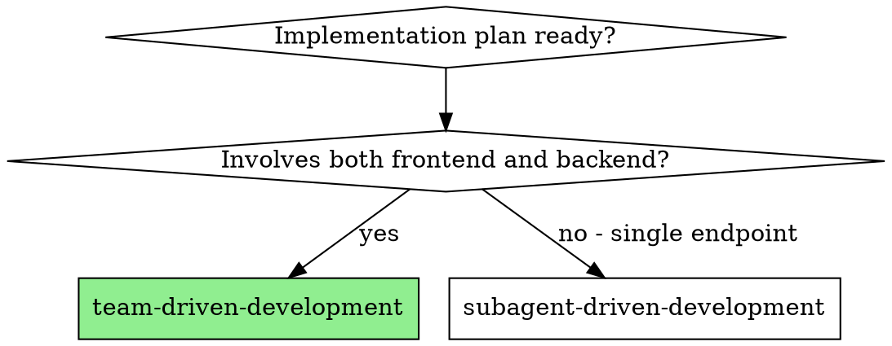

# Team-Driven Development

## Overview

Execute implementation plans that involve both frontend and backend development using an Agent Team collaboration model. Multiple specialized agents work in parallel, coordinated by a team-coordinator agent.

## Document Verification Gate

<VERIFICATION-GATE>
Every document output step MUST be followed by existence verification. This is NON-NEGOTIABLE.

**Verification Protocol:**
```
After claiming to create/write/save a document:
1. STOP - Do not proceed to next step
2. Use Read tool to check file exists at the claimed path
3. If file does NOT exist:
   - STOP immediately
   - Create the document NOW
   - Re-verify existence
   - Do NOT skip to next step
4. If file EXISTS:
   - Confirm to user: "✅ Document saved: {path}"
   - Only then proceed to next step
```

**Documents to verify in this skill:**
- `.claude/team-session/design-doc.md` — Design document
- `.claude/team-session/plan.md` — Implementation plan
- `.claude/team-session/frontend-tasks.md` — Frontend task status
- `.claude/team-session/backend-tasks.md` — Backend task status
- `.claude/team-session/api-changes.md` — API change log
- `.claude/team-session/blockers.md` — Blocker issues
</VERIFICATION-GATE>

## When to Use



## Agent Roles

| Role | Responsibility | Input | Output |
|------|----------------|-------|--------|
| **team-coordinator** | Coordinate task distribution, monitor progress, Code Review, handle blockers | Design doc, Implementation plan | Coordination decisions, Review results |
| **frontend-developer** | Implement frontend functionality | Frontend tasks, API definitions | Pages, components, API calls |
| **backend-developer** | Implement backend functionality | Backend tasks | Controller, Service, Mapper code |

## Communication Mechanism

Agents communicate through shared files:

```
.claude/team-session/
├── design-doc.md           # Design document (read-only, shared)
├── plan.md                 # Implementation plan (read-only, shared)
├── frontend-tasks.md       # Frontend task status
├── backend-tasks.md        # Backend task status
├── api-changes.md          # API change log
├── blockers.md             # Blocker issues
└── review-feedback/        # Review feedback
    ├── frontend.md
    └── backend.md
```

## Process Flow

```
Phase 1: Plan Distribution
team-coordinator analyzes plan, identifies dependencies, dispatches tasks

Phase 2: Parallel Development
┌─────────────────┬─────────────────┐
│ backend-developer │ frontend-developer │
│ - Implement backend│ - Implement frontend│
│ - TDD workflow    │ - TDD workflow      │
│ - Notify on done  │ - Notify on done    │
└─────────────────┴─────────────────┘

Phase 3: Code Review (after each endpoint completes)
team-coordinator reviews code
- Spec compliance check
- Code quality check
- Feedback for fixes or approval

Phase 4: API Change Handling (if needed)
If either side needs to change API:
1. Update design document
2. team-coordinator notifies other side
3. Other side adjusts implementation

Phase 5: Integration Verification (after all complete)
team-coordinator coordinates integration testing
- Confirm frontend-backend API matching
- Verify complete flow

Phase 6: Completion
- Call xo1997-dev:finishing-a-development-branch skill
- Handle branch merge/PR
```

## Execution Steps

### Step 1: Initialize Team Session

Create communication directory and files:

```bash
mkdir -p .claude/team-session/review-feedback
touch .claude/team-session/{frontend-tasks.md,backend-tasks.md,api-changes.md,blockers.md}
```

**✅ VERIFY communication files exist:**
- Use Read tool to check each file exists
- If any missing, create it NOW before proceeding
- Confirm: "✅ Team session initialized with all communication files"

### Step 2: Dispatch team-coordinator

The team-coordinator:
1. Reads the design document and implementation plan
2. Identifies task dependencies between frontend and backend
3. Determines parallel vs sequential execution order
4. Creates task status files for frontend and backend

### Step 3: Parallel Development

Dispatch both developer agents in parallel:

**backend-developer** works on:
- Controller, Service, Mapper implementation
- Following TDD workflow
- Using Spring Boot best practices

**frontend-developer** works on:
- Pages and components
- API integration
- Following Vue3 best practices

### Step 4: Task Status Updates

Agents update their status files:

```markdown
## Task Status

### Task 1: User List API
- Status: completed
- Output: src/main/java/.../UserController.java
- Commit: abc1234

### Task 2: User Detail API
- Status: in_progress
- Started: 2026-03-17 14:30
```

### Step 5: Handle Blockers

When an agent encounters a blocker:

```markdown
## Blockers

### 2026-03-17 14:45 - frontend-developer
**Issue:** API definition unclear - UserVO.role field type
**Impact:** Cannot complete UserList component
**Proposed:** Need clarification on role field (String or Enum?)
```

team-coordinator responds:
1. Review the blocker
2. Coordinate with relevant party
3. Update design document if needed
4. Notify affected agents

### Step 6: API Change Notification

When API needs to change:

```markdown
## API Changes

### 2026-03-17 15:00 - backend-developer
**Endpoint:** GET /api/users
**Change:** Added `role` field to UserVO
**Reason:** Required for permission check
**Breaking:** No (additive change)
```

### Step 7: Code Review

After each endpoint completes, team-coordinator:
1. Dispatches spec reviewer
2. Dispatches code quality reviewer
3. Records feedback in `review-feedback/*.md`
4. Notifies developer of required fixes

### Step 8: Integration Verification

After both endpoints complete:
1. Verify frontend API calls match backend endpoints
2. Run integration tests
3. Test complete user flows

### Step 9: Completion

1. Call `xo1997-dev:finishing-a-development-branch` skill
2. Handle branch merge or PR creation
3. Clean up worktree

## Communication Rules

| Event | Action | File |
|-------|--------|------|
| Task starts | Update status to `in_progress` | `*-tasks.md` |
| Task completes | Update status to `completed`, record output | `*-tasks.md` |
| Blocker encountered | Write blocker description | `blockers.md` |
| API changes | Record change and reason | `api-changes.md` |
| Review feedback | Write feedback content | `review-feedback/*.md` |

## Error Handling

### Common Scenarios

| Scenario | Handling |
|----------|----------|
| API definition unclear | team-coordinator coordinates clarification |
| Frontend-backend conflict | team-coordinator arbitrates, updates design doc |
| One side blocked | team-coordinator assesses impact, adjusts plan |
| Test failure | Agent debugs independently, coordinates if needed |

### Advanced Failure Scenarios

| Scenario | Action |
|----------|--------|
| Agent timeout (>30 min blocked) | team-coordinator checks progress, offers help or escalates |
| Agent execution failure | Log error, retry with more context, or escalate to human |
| API conflict (both sides want changes) | team-coordinator arbitrates based on business needs |
| team-coordinator failure | Pause all agents, wait for human intervention |
| Integration verification fails | Roll back to last known good state, identify root cause |
| One side completes, other fails | Preserve completed work, document pending, hand off to human |

### Escalation Path

When team-coordinator cannot auto-resolve, escalate to human:

1. **Escalation triggers:**
   - Blocker unresolved after 3 attempts
   - API conflict with no clear best option
   - Both agents stuck waiting for each other
   - Integration tests fail repeatedly
   - team-coordinator itself encounters error

2. **Escalation process:**
   ```
   1. Log escalation reason to blockers.md
   2. Summarize current state and options
   3. Present clear choices to human
   4. Wait for human decision
   5. Execute human's decision
   ```

3. **Human decision options:**
   - Choose preferred API design
   - Skip problematic feature temporarily
   - Adjust requirements
   - Manual code intervention

### Recovery Mechanism

- **State checkpoints**: Each task completion writes to status files
- **Rollback points**: After each successful review, create checkpoint
- **Resume capability**: Can resume from any checkpoint if interrupted

## Best Practices

1. **Clear API contracts**: Define APIs precisely before starting
2. **Frequent communication**: Update status files promptly
3. **TDD for both sides**: Follow test-driven development
4. **Small incremental changes**: Commit frequently
5. **Review early**: Don't wait for all tasks to complete

## Required Skills

- `xo1997-dev:using-git-worktrees` - Set up isolated workspace
- `xo1997-dev:writing-plans` - Creates the plan this skill executes
- `xo1997-dev:test-driven-development` - Agents follow TDD
- `xo1997-dev:requesting-code-review` - Review process
- `xo1997-dev:finishing-a-development-branch` - Complete work

> **Note:** If any required skill is unavailable, the team-coordinator should escalate to human before starting execution.