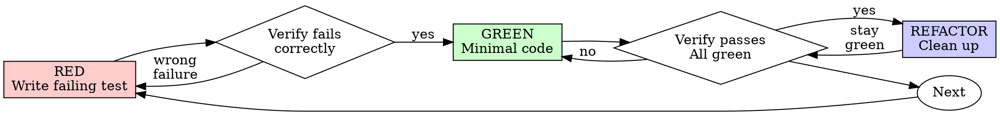

# Test-Driven Development (TDD)

## Overview

Write the test first. Watch it fail. Write minimal code to pass.

**Core principle:** If you didn't watch the test fail, you don't know if it tests the right thing.

**Violating the letter of the rules is violating the spirit of the rules.**

## When to Use

**Always:**
- New features
- Bug fixes
- Refactoring
- Behavior changes

**Exceptions (ask your human partner):**
- Throwaway prototypes
- Generated code
- Configuration files

Thinking "skip TDD just this once"? Stop. That's rationalization.

## The Iron Law

```
NO PRODUCTION CODE WITHOUT A FAILING TEST FIRST
```

Write code before the test? Delete it. Start over.

**No exceptions:**
- Don't keep it as "reference"
- Don't "adapt" it while writing tests
- Don't look at it
- Delete means delete

Implement fresh from tests. Period.

## Red-Green-Refactor



### RED - Write Failing Test

Write one minimal test showing what should happen.

<Good>
```java
@ExtendWith(MockitoExtension.class)
class UserServiceTest {

    @Mock
    private UserMapper userMapper;

    @InjectMocks
    private UserServiceImpl userService;

    @Test
    void shouldReturnUser_whenUserExists() {
        // Given
        User expected = new User(1L, "张三");
        when(userMapper.selectById(1L)).thenReturn(expected);

        // When
        User result = userService.getById(1L);

        // Then
        assertEquals("张三", result.getName());
        verify(userMapper).selectById(1L);
    }
}
```
Clear name (shouldReturnUser_whenUserExists), tests real behavior, one thing
</Good>

<Bad>
```java
@Test
void test1() {
    User user = new User();
    user.setName("test");
    // No assertion, no clear behavior being tested
}
```
Vague name, no clear assertion
</Bad>

**Requirements:**
- One behavior
- Clear name (shouldXxx_whenYyy pattern)
- Real code (mocks only for external dependencies)

### Verify RED - Watch It Fail

**MANDATORY. Never skip.**

```bash
# Run single test class
mvn test -Dtest=UserServiceTest

# Run single test method
mvn test -Dtest=UserServiceTest#shouldReturnUser_whenUserExists

# Run all tests
mvn test
```

Confirm:
- Test fails (not errors)
- Failure message is expected
- Fails because feature missing (not typos)

**Test passes?** You're testing existing behavior. Fix test.

**Test errors?** Fix error, re-run until it fails correctly.

### GREEN - Minimal Code

Write simplest code to pass the test.

<Good>
```java
@Service
public class UserServiceImpl implements UserService {

    private final UserMapper userMapper;

    public UserServiceImpl(UserMapper userMapper) {
        this.userMapper = userMapper;
    }

    @Override
    public User getById(Long id) {
        return userMapper.selectById(id);
    }
}
```
Just enough to pass
</Good>

<Bad>
```java
@Service
public class UserServiceImpl implements UserService {

    private final UserMapper userMapper;
    private final CacheManager cacheManager;  // YAGNI
    private final EventPublisher eventPublisher;  // YAGNI

    @Override
    public User getById(Long id) {
        // Over-engineered for a simple test
        cacheManager.get(id);
        User user = userMapper.selectById(id);
        eventPublisher.publish(new UserEvent(user));
        return user;
    }
}
```
Over-engineered
</Bad>

Don't add features, refactor other code, or "improve" beyond the test.

### Verify GREEN - Watch It Pass

**MANDATORY.**

```bash
mvn test -Dtest=UserServiceTest
```

Confirm:
- Test passes
- Other tests still pass
- Output pristine (no errors, warnings)

**Test fails?** Fix code, not test.

**Other tests fail?** Fix now.

### REFACTOR - Clean Up

After green only:
- Remove duplication
- Improve names
- Extract helpers

Keep tests green. Don't add behavior.

### Commit

After REFACTOR, commit your changes:

**REQUIRED SUB-SKILL:** Use xo1997-dev:committing-changes

Follow that skill to write conventional commit messages.

### Repeat

Next failing test for next feature.

## Good Tests

| Quality | Good | Bad |
|---------|------|-----|
| **Minimal** | One thing. "and" in name? Split it. | `test('validates email and domain and whitespace')` |
| **Clear** | Name describes behavior (shouldXxx_whenYyy) | `test('test1')` |
| **Shows intent** | Demonstrates desired API | Obscures what code should do |

## Why Order Matters

**"I'll write tests after to verify it works"**

Tests written after code pass immediately. Passing immediately proves nothing:
- Might test wrong thing
- Might test implementation, not behavior
- Might miss edge cases you forgot
- You never saw it catch the bug

Test-first forces you to see the test fail, proving it actually tests something.

**"I already manually tested all the edge cases"**

Manual testing is ad-hoc. You think you tested everything but:
- No record of what you tested
- Can't re-run when code changes
- Easy to forget cases under pressure
- "It worked when I tried it" ≠ comprehensive

Automated tests are systematic. They run the same way every time.

**"Deleting X hours of work is wasteful"**

Sunk cost fallacy. The time is already gone. Your choice now:
- Delete and rewrite with TDD (X more hours, high confidence)
- Keep it and add tests after (30 min, low confidence, likely bugs)

The "waste" is keeping code you can't trust. Working code without real tests is technical debt.

**"TDD is dogmatic, being pragmatic means adapting"**

TDD IS pragmatic:
- Finds bugs before commit (faster than debugging after)
- Prevents regressions (tests catch breaks immediately)
- Documents behavior (tests show how to use code)
- Enables refactoring (change freely, tests catch breaks)

"Pragmatic" shortcuts = debugging in production = slower.

**"Tests after achieve the same goals - it's spirit not ritual"**

No. Tests-after answer "What does this do?" Tests-first answer "What should this do?"

Tests-after are biased by your implementation. You test what you built, not what's required. You verify remembered edge cases, not discovered ones.

Tests-first force edge case discovery before implementing. Tests-after verify you remembered everything (you didn't).

30 minutes of tests after ≠ TDD. You get coverage, lose proof tests work.

## Common Rationalizations

| Excuse | Reality |
|--------|---------|
| "Too simple to test" | Simple code breaks. Test takes 30 seconds. |
| "I'll test after" | Tests passing immediately prove nothing. |
| "Tests after achieve same goals" | Tests-after = "what does this do?" Tests-first = "what should this do?" |
| "Already manually tested" | Ad-hoc ≠ systematic. No record, can't re-run. |
| "Deleting X hours is wasteful" | Sunk cost fallacy. Keeping unverified code is technical debt. |
| "Keep as reference, write tests first" | You'll adapt it. That's testing after. Delete means delete. |
| "Need to explore first" | Fine. Throw away exploration, start with TDD. |
| "Test hard = design unclear" | Listen to test. Hard to test = hard to use. |
| "TDD will slow me down" | TDD faster than debugging. Pragmatic = test-first. |
| "Manual test faster" | Manual doesn't prove edge cases. You'll re-test every change. |
| "Existing code has no tests" | You're improving it. Add tests for existing code. |

## Red Flags - STOP and Start Over

- Code before test
- Test after implementation
- Test passes immediately
- Can't explain why test failed
- Tests added "later"
- Rationalizing "just this once"
- "I already manually tested it"
- "Tests after achieve the same purpose"
- "It's about spirit not ritual"
- "Keep as reference" or "adapt existing code"
- "Already spent X hours, deleting is wasteful"
- "TDD is dogmatic, I'm being pragmatic"
- "This is different because..."

**All of these mean: Delete code. Start over with TDD.**

## Spring Boot Test Annotations

### Unit Tests

```java
// Service layer test - use Mockito
@ExtendWith(MockitoExtension.class)
class UserServiceTest {

    @Mock
    private UserMapper userMapper;

    @InjectMocks
    private UserServiceImpl userService;

    @Test
    void shouldCreateUser() {
        // Given
        UserCreateDTO dto = new UserCreateDTO("张三");
        User expected = new User(1L, "张三");
        when(userMapper.insert(any())).thenReturn(1);

        // When
        User result = userService.create(dto);

        // Then
        assertNotNull(result);
    }
}
```

### Controller Tests

```java
// Controller test - use @WebMvcTest
@WebMvcTest(UserController.class)
class UserControllerTest {

    @Autowired
    private MockMvc mockMvc;

    @MockBean
    private UserService userService;

    @Test
    void shouldReturnUser_whenUserExists() throws Exception {
        // Given
        User user = new User(1L, "张三");
        when(userService.getById(1L)).thenReturn(user);

        // When & Then
        mockMvc.perform(get("/api/users/1"))
            .andExpect(status().isOk())
            .andExpect(jsonPath("$.data.name").value("张三"));
    }
}
```

### Integration Tests (MyBatis-Plus)

```java
// Integration test - use @SpringBootTest + H2
@SpringBootTest
@AutoConfigureTestDatabase(replace = AutoConfigureTestDatabase.Replace.ANY)
class UserMapperIntegrationTest {

    @Autowired
    private UserMapper userMapper;

    @Test
    void shouldInsertAndSelectUser() {
        // Given
        User user = new User();
        user.setName("张三");

        // When
        userMapper.insert(user);
        User found = userMapper.selectById(user.getId());

        // Then
        assertNotNull(found);
        assertEquals("张三", found.getName());
    }
}
```

### H2 Configuration for Tests

```yaml
# test/resources/application.yml
spring:
  datasource:
    driver-class-name: org.h2.Driver
    url: jdbc:h2:mem:testdb;DB_CLOSE_DELAY=-1;MODE=MySQL
    username: sa
    password:
  sql:
    init:
      mode: always
      schema-locations: classpath:schema.sql
      data-locations: classpath:data.sql
```

## Mockito Quick Reference

### Mock Initialization

```java
@ExtendWith(MockitoExtension.class)
class ExampleTest {

    @Mock
    private Dependency dependency;

    @InjectMocks
    private Service service;

    @Spy
    @InjectMocks
    private ServiceWithPartialMock serviceWithPartial;
}
```

### Common Patterns

```java
// Return value
when(mock.method()).thenReturn(value);
when(mock.method()).thenReturn(value1, value2);  // Multiple calls
when(mock.method()).thenThrow(new RuntimeException());

// Void methods
doNothing().when(mock).voidMethod();
doThrow(new RuntimeException()).when(mock).voidMethod();

// Argument matchers
when(mock.method(any())).thenReturn(value);
when(mock.method(eq("specific"))).thenReturn(value);
when(mock.method(anyString())).thenReturn(value);

// Verification
verify(mock).method();
verify(mock, times(2)).method();
verify(mock, never()).method();
verify(mock, atLeast(1)).method();

// Spy - partial mock
@Spy
private RealObject spyObject;

@Test
void testWithSpy() {
    // Real method called
    when(spyObject.realMethod()).thenCallRealMethod();

    // Partial mock
    doReturn("mocked").when(spyObject).otherMethod();
}
```

## Example: Bug Fix

**Bug:** Empty username accepted

**RED**
```java
@Test
void shouldRejectEmptyUsername() {
    // Given
    UserCreateDTO dto = new UserCreateDTO("");

    // When & Then
    assertThrows(BadRequestException.class, () -> userService.create(dto));
}
```

**Verify RED**
```bash
$ mvn test -Dtest=UserServiceTest#shouldRejectEmptyUsername
FAIL: Expected BadRequestException, but nothing was thrown
```

**GREEN**
```java
public User create(UserCreateDTO dto) {
    if (dto.getName() == null || dto.getName().trim().isEmpty()) {
        throw new BadRequestException("用户名不能为空");
    }
    // ...
}
```

**Verify GREEN**
```bash
$ mvn test -Dtest=UserServiceTest#shouldRejectEmptyUsername
PASS
```

**REFACTOR**
Extract validation for multiple fields if needed.

## Verification Checklist

Before marking work complete:

- [ ] Every new function/method has a test
- [ ] Watched each test fail before implementing
- [ ] Each test failed for expected reason (feature missing, not typo)
- [ ] Wrote minimal code to pass each test
- [ ] All tests pass (`mvn test`)
- [ ] Output pristine (no errors, warnings)
- [ ] Tests use real code (mocks only if unavoidable)
- [ ] Edge cases and errors covered

Can't check all boxes? You skipped TDD. Start over.

## When Stuck

| Problem | Solution |
|---------|----------|
| Don't know how to test | Write wished-for API. Write assertion first. Ask your human partner. |
| Test too complicated | Design too complicated. Simplify interface. |
| Must mock everything | Code too coupled. Use dependency injection. |
| Test setup huge | Extract helpers. Still complex? Simplify design. |

## Debugging Integration

Bug found? Write failing test reproducing it. Follow TDD cycle. Test proves fix and prevents regression.

Never fix bugs without a test.

## Testing Anti-Patterns

When adding mocks or test utilities, read @testing-anti-patterns.md to avoid common pitfalls:
- Testing mock behavior instead of real behavior
- Adding test-only methods to production classes
- Mocking without understanding dependencies

## Final Rule

```
Production code → test exists and failed first
Otherwise → not TDD
```

No exceptions without your human partner's permission.