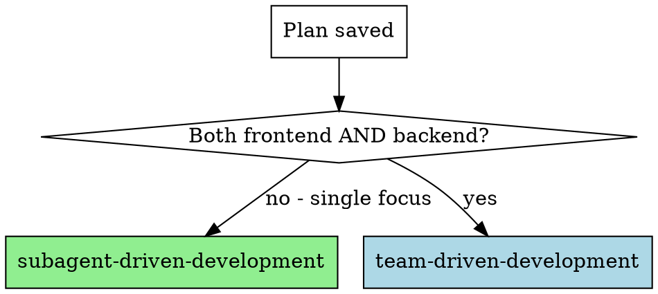

# Writing Plans

## Overview

Write comprehensive implementation plans assuming the engineer has zero context for our codebase and questionable taste. Document everything they need to know: which files to touch for each task, code, testing, docs they might need to check, how to test it. Give them the whole plan as bite-sized tasks. DRY. YAGNI. TDD. Frequent commits.

Assume they are a skilled developer, but know almost nothing about our toolset or problem domain. Assume they don't know good test design very well.

**Announce at start:** "I'm using the writing-plans skill to create the implementation plan."

**Context:** This should be run in a dedicated worktree (created by brainstorming skill).

**Save plans to:** `docs/specs/feature_{模块}_{功能}_{日期}/plan.md`
- (User preferences for plan location override this default)

## Scope Check

If the spec covers multiple independent subsystems, it should have been broken into sub-project specs during brainstorming. If it wasn't, suggest breaking this into separate plans — one per subsystem. Each plan should produce working, testable software on its own.

## Database Schema Design

**Database schema design is done in two phases:**

1. **Discussion Phase (Brainstorming):** Discuss and design database schema during brainstorming
2. **Confirmation Phase (Writing Plans):** Finalize and confirm schema design in the plan

**Schema design document location:** `docs/specs/feature_{模块}_{功能}_{日期}/database.md`

**Schema optimization:** Continuous optimization during development, considering performance issues

## Spring Boot Project Structure

### Module-based Package Structure

```
src/main/java/com/example/
├── common/                          # 公共组件
│   ├── exception/                   # 统一异常处理
│   │   ├── GlobalExceptionHandler.java
│   │   └── BusinessException.java
│   └── result/                      # 统一响应格式
│       └── Result.java
├── schedule/                        # 定时任务
│   └── ScheduleTask.java
├── module/                          # 业务模块
│   ├── user/                        # 用户模块
│   │   ├── controller/
│   │   │   └── UserController.java
│   │   ├── service/
│   │   │   ├── UserService.java
│   │   │   └── impl/
│   │   │       └── UserServiceImpl.java
│   │   ├── mapper/
│   │   │   └── UserMapper.java
│   │   ├── entity/
│   │   │   └── User.java
│   │   ├── dto/
│   │   │   └── UserCreateDTO.java
│   │   ├── vo/
│   │   │   └── UserVO.java
│   │   ├── constants/
│   │   │   └── UserConstants.java
│   │   └── enums/
│   │       └── UserStatus.java
│   └── video/                       # 视频模块
│       └── ...
└── Application.java
```

### File Creation Order (Top-Down)

**Create files in this order:**

1. **Controller** - Define API endpoints
2. **DTO/VO** - Define request/response objects
3. **Service Interface** - Define business methods
4. **Service Implementation** - Implement business logic
5. **Mapper** - Define data access
6. **Entity** - Define database mapping
7. **Test** - Write tests

**Why top-down?** Define the API interface first, then implement layer by layer.

## File Structure

Before defining tasks, map out which files will be created or modified and what each one is responsible for. This is where decomposition decisions get locked in.

- Design units with clear boundaries and well-defined interfaces. Each file should have one clear responsibility.
- You reason best about code you can hold in context at once, and your edits are more reliable when files are focused. Prefer smaller, focused files over large ones that do too much.
- Files that change together should live together. Split by responsibility within modules.
- In existing codebases, follow established patterns. If the codebase uses large files, don't unilaterally restructure - but if a file you're modifying has grown unwieldy, including a split in the plan is reasonable.

This structure informs the task decomposition. Each task should produce self-contained changes that make sense independently.

## Bite-Sized Task Granularity

**Each step is one action (2-5 minutes):**
- "Write the failing test" - step
- "Run it to make sure it fails" - step
- "Implement the minimal code to make the test pass" - step
- "Run the tests and make sure they pass" - step
- "Commit" - step

## Plan Document Header

**Every plan MUST start with this header:**

```markdown
# [Feature Name] Implementation Plan

> **For agentic workers:** REQUIRED: Use subagent-driven-development (if subagents available) or executing-plans to implement this plan. Steps use checkbox (`- [ ]`) syntax for tracking.

**Goal:** [One sentence describing what this builds]

**Architecture:** [2-3 sentences about approach]

**Tech Stack:** Spring Boot 2.7.18, MyBatis-Plus 3.5.7, MySQL, etc.

---
```

## Task Structure

````markdown
### Task N: [Component Name]

**Files:**
- Create: `src/main/java/com/example/module/user/controller/UserController.java`
- Create: `src/main/java/com/example/module/user/dto/UserCreateDTO.java`
- Create: `src/main/java/com/example/module/user/vo/UserVO.java`
- Create: `src/main/java/com/example/module/user/service/UserService.java`
- Create: `src/main/java/com/example/module/user/service/impl/UserServiceImpl.java`
- Create: `src/main/java/com/example/module/user/mapper/UserMapper.java`
- Create: `src/main/java/com/example/module/user/entity/User.java`
- Create: `src/test/java/com/example/module/user/service/UserServiceTest.java`

- [ ] **Step 1: Write the failing test**

```java
@ExtendWith(MockitoExtension.class)
class UserServiceTest {
    @Mock
    private UserMapper userMapper;

    @InjectMocks
    private UserServiceImpl userService;

    @Test
    void shouldCreateUser_whenValidInput() {
        // Given
        UserCreateDTO dto = new UserCreateDTO("张三");
        when(userMapper.insert(any())).thenReturn(1);

        // When
        UserVO result = userService.create(dto);

        // Then
        assertNotNull(result);
        assertEquals("张三", result.getName());
    }
}
```

- [ ] **Step 2: Run test to verify it fails**

Run: `mvn test -Dtest=UserServiceTest#shouldCreateUser_whenValidInput`
Expected: FAIL with "Cannot resolve method 'create'"

- [ ] **Step 3: Write minimal implementation**

```java
@Service
public class UserServiceImpl implements UserService {
    private final UserMapper userMapper;

    public UserServiceImpl(UserMapper userMapper) {
        this.userMapper = userMapper;
    }

    @Override
    public UserVO create(UserCreateDTO dto) {
        User user = new User();
        user.setName(dto.getName());
        userMapper.insert(user);
        return new UserVO(user.getId(), user.getName());
    }
}
```

- [ ] **Step 4: Run test to verify it passes**

Run: `mvn test -Dtest=UserServiceTest#shouldCreateUser_whenValidInput`
Expected: PASS

- [ ] **Step 5: Commit**

**REQUIRED SUB-SKILL:** Use xo1997-dev:committing-changes

Stage and commit with conventional message (ask user for issue ID):
```bash
git add src/main/java/com/example/module/user/
git add src/test/java/com/example/module/user/
git commit -m "关联单号：<用户提供> feat(user): 添加用户创建功能"
```
````

## Database Schema Design Template

**Include in `docs/specs/feature_{模块}_{功能}_{日期}/database.md`:**

```markdown
## 用户表 (t_user)

| 字段名 | 类型 | 是否为空 | 默认值 | 说明 |
|--------|------|----------|--------|------|
| id | BIGINT | NOT NULL | AUTO_INCREMENT | 主键 |
| name | VARCHAR(100) | NOT NULL | - | 用户名 |
| email | VARCHAR(100) | NULL | - | 邮箱 |
| create_by | VARCHAR(30) | NULL | - | 创建人 |
| create_time | DATETIME | NOT NULL | CURRENT_TIMESTAMP | 创建时间 |
| update_by | VARCHAR(30) | NULL | - | 更新人 |
| update_time | DATETIME | NOT NULL | CURRENT_TIMESTAMP | 更新时间 |
| is_del | TINYINT(1) | NOT NULL | 0 | 逻辑删除(0:未删除,1:删除) |

**索引设计：**
- PRIMARY KEY (id)
- UNIQUE KEY uk_email (email)
- KEY idx_create_time (create_time)

**性能优化考虑：**
- email 建立唯一索引，支持快速查询和唯一性校验
- create_time 建立索引，支持时间范围查询
```

## Audit Fields Verification (MANDATORY for Spring Boot Projects)

**Before finalizing any Entity class, you MUST verify it includes audit fields:**

| Field | Type | Annotation | Description |
|-------|------|------------|-------------|
| `id` | Long | `@TableId(type = IdType.AUTO)` | Primary key |
| `createBy` | String | `@TableField(fill = FieldFill.INSERT)` | Creator |
| `createTime` | LocalDateTime | `@TableField(fill = FieldFill.INSERT)` | Creation time |
| `updateBy` | String | `@TableField(fill = FieldFill.INSERT_UPDATE)` | Updater |
| `updateTime` | LocalDateTime | `@TableField(fill = FieldFill.INSERT_UPDATE)` | Update time |
| `isDel` | Integer | `@TableLogic` | Logical delete flag |

**Verification Checklist:**

When writing Entity class in the plan, add a verification step:

```markdown
- [ ] **Verify audit fields in Entity**

Check that Entity includes:
- [ ] `@TableName("t_xxx")` annotation
- [ ] `@TableId(type = IdType.AUTO)` for id field
- [ ] `@TableField(fill = FieldFill.INSERT)` for createBy, createTime
- [ ] `@TableField(fill = FieldFill.INSERT_UPDATE)` for updateBy, updateTime
- [ ] `@TableLogic` for isDel field
```

**If Entity does NOT need audit fields**, document the reason in the plan:
> Note: This entity does not include standard audit fields because [reason]

## Remember
- Exact file paths always
- Complete code in plan (not "add validation")
- Exact commands with expected output
- Reference relevant skills with @ syntax
- DRY, YAGNI, TDD, frequent commits
- Top-down file creation (Controller -> DTO/VO -> Service -> Mapper -> Entity)
- Include database schema design

## Plan Review Loop

After completing each chunk of the plan:

1. Dispatch plan-document-reviewer subagent (see plan-document-reviewer-prompt.md) with precisely crafted review context — never your session history. This keeps the reviewer focused on the plan, not your thought process.
   - Provide: chunk content, path to spec document
2. If ❌ Issues Found:
   - Fix the issues in the chunk
   - Re-dispatch reviewer for that chunk
   - Repeat until ✅ Approved
3. If ✅ Approved: proceed to next chunk (or execution handoff if last chunk)

**Chunk boundaries:** Use `## Chunk N: <name>` headings to delimit chunks. Each chunk should be ≤1000 lines and logically self-contained.

**Review loop guidance:**
- Same agent that wrote the plan fixes it (preserves context)
- If loop exceeds 5 iterations, surface to human for guidance
- Reviewers are advisory - explain disagreements if you believe feedback is incorrect

## Execution Handoff

After saving the plan:

**"Plan complete and saved to `docs/specs/feature_{模块}_{功能}_{日期}/plan.md`. Ready to execute?"**

### Execution Mode Selection

Choose the execution mode based on plan scope:



**Decision rules:**
- **subagent-driven-development**: Single focus (frontend only OR backend only)
  - Fresh subagent per task + two-stage review (spec compliance, then code quality)
  - Works well for focused changes with clear boundaries
- **team-driven-development**: Both frontend AND backend work required
  - Multi-agent coordination (team-coordinator, frontend-developer, backend-developer)
  - Parallel development with shared communication files
  - Use when frontend and backend tasks have dependencies

### Harness Capability Check

**If harness has subagents (Claude Code, etc.):**
- Use the execution mode selected above (subagent-driven or team-driven)
- Do NOT offer a choice - follow the decision rules
- Both modes leverage subagents effectively

**If harness does NOT have subagents:**
- Execute plan in current session using executing-plans
- Batch execution with checkpoints for review